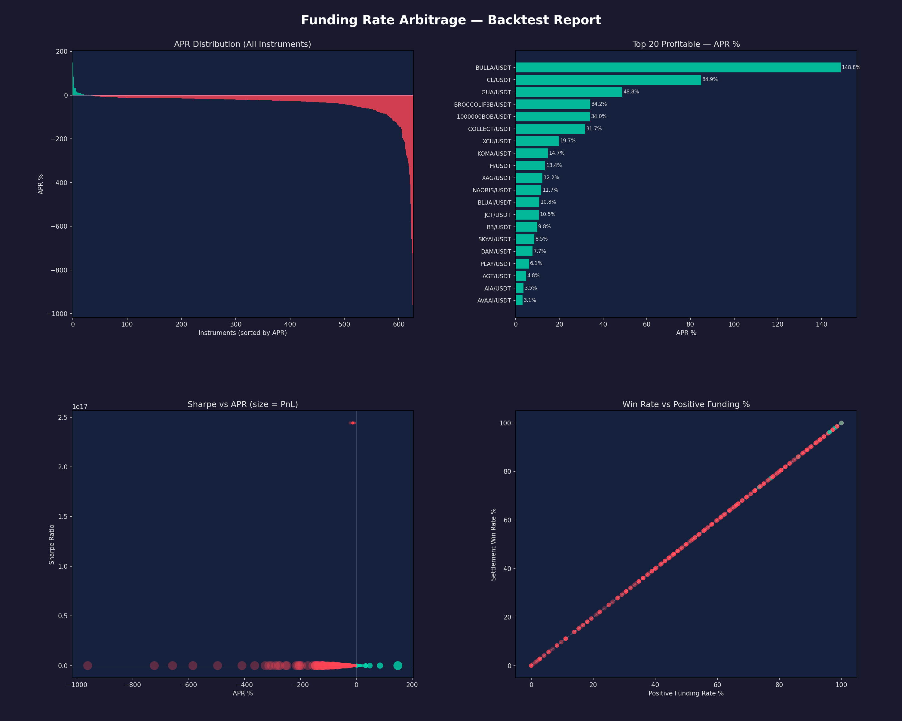
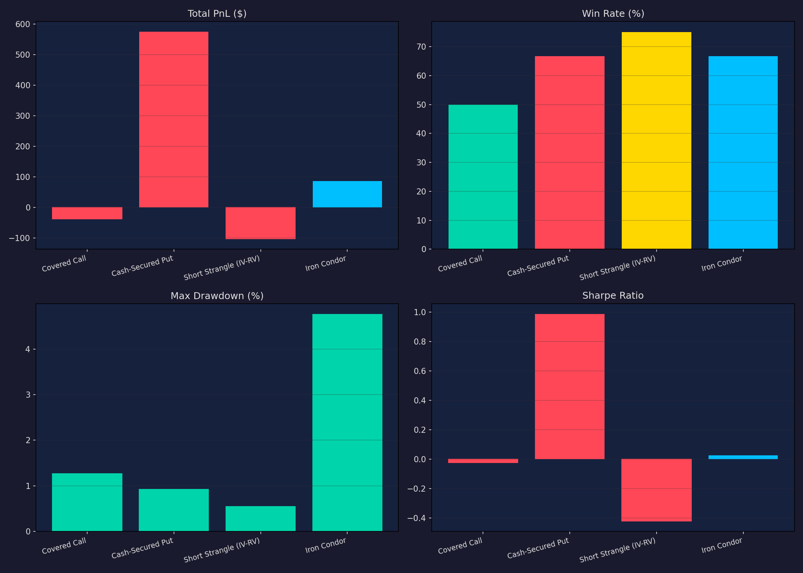
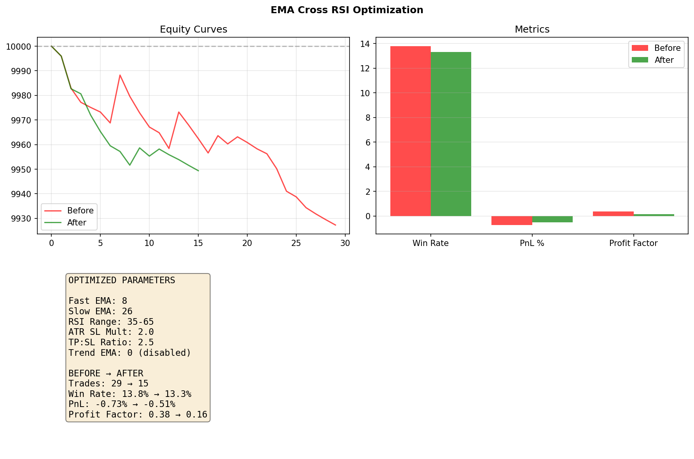
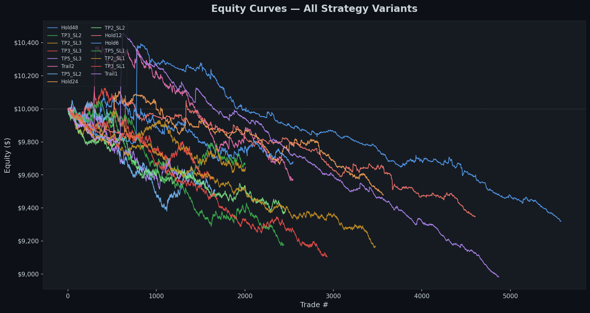

# AlphaHub

A collection of crypto trading research, backtesting frameworks, and alpha discovery tools. Covers funding rate arbitrage, options strategies, momentum trading, and real-time monitoring across Binance, OKX, and Deribit.

## Projects

### 📈 [Funding Rate Arbitrage](projects/funding_rate_arb/)
Delta-neutral yield strategy — long spot + short perp to collect funding payments.

- Screener, cross-exchange analyzer, and full backtester
- **627 instruments** backtested across Binance & OKX
- Top result: **148% APR** (BULLA/USDT), 31 profitable instruments after fees



---

### 🎯 [Options Backtester](projects/options_backtest/)
Backtests crypto options selling strategies with Black-Scholes pricing and Monte Carlo simulation.

- 4 strategies: covered call, cash-secured put, short strangle, iron condor
- Calibrated to real Deribit/Binance volatility data
- Key insight: **IV consistently overprices RV** in crypto — structural edge for sellers



---

### ⚡ [Momentum Perp Trading](projects/momentum_perp/)
Production trading system for OKX perpetual futures with Telegram bot control.

- 5 strategies with automated signal generation & execution
- Risk management, position sizing, and real-time monitoring
- **EMA Cross RSI** selected as primary after optimization



---

### 🔍 [Momentum Scanner (Binance Alpha)](projects/momentum_scanner/)
Detects momentum opportunities from Binance Alpha token listings.

- Real-time monitoring of new listings via pipeline
- Backtested jump detection strategies
- Finding: **first 1-4 hours** post-listing have strongest momentum signals



---

### 📊 [Momentum Trading (Low-Liq Pairs)](projects/momentum_trading/)
Backtests momentum strategies on 379 low-liquidity Binance Futures pairs ($1M–$20M daily volume).

- 5 strategies on 4h timeframe with 14 months of data
- Best: **RSI Momentum** (+$24k, 0.36 Sharpe)
- Top pairs: AUCTION, ACH, BAN, CAKE

---

### 🔔 [Binance Alpha Monitor](projects/bn_alpha_monitor/)
Real-time monitoring of Binance Alpha token listings and stability metrics.

## Architecture

```
AlphaHub/
├── adaptor/             # Exchange API clients
│   ├── binance/         #   Binance Spot + Futures
│   ├── okx/             #   OKX Perpetuals
│   └── deribit/         #   Deribit Options
├── pipeline/            # Data collection pipeline
│   ├── job_manager.py   #   Job scheduler
│   └── jobs/            #   Instrument, funding rate, kline jobs
├── database/            # PostgreSQL schema & client
│   ├── schema.sql       #   Main schema
│   └── schema/          #   Module-specific schemas
├── projects/            # Trading strategy projects
│   ├── funding_rate_arb/    # Funding rate arbitrage
│   ├── options_backtest/    # Options strategy backtester
│   ├── momentum_perp/       # OKX perp trading system
│   ├── momentum_scanner/    # Binance Alpha momentum
│   ├── momentum_trading/    # Low-liq pair momentum
│   ├── options_strategies/  # Options analysis tools
│   └── bn_alpha_monitor/    # Binance Alpha monitor
├── scripts/             # Utility & data seeding scripts
└── requirements.txt
```

## Tech Stack

- **Languages:** Python 3.12+
- **Exchanges:** Binance, OKX, Deribit (REST + WebSocket)
- **Database:** PostgreSQL (Neon)
- **Analysis:** pandas, numpy, scipy, matplotlib
- **Trading:** python-okx, httpx, asyncpg
- **Notifications:** Telegram Bot API

## Setup

```bash
# Clone
git clone https://github.com/davidting0918/AlphaHub.git
cd AlphaHub

# Virtual environment
python -m venv .venv && source .venv/bin/activate

# Dependencies
pip install -r requirements.txt

# Configure
cp .env.example .env  # Add your API keys and DB URL

# Run data pipeline
python -m pipeline.job_manager

# Run any project
python -m projects.funding_rate_arb.backtester
python -m projects.options_backtest.run
python -m projects.momentum_perp.run --full
```

## Data Pipeline

The shared pipeline collects market data into PostgreSQL:

| Job | Data | Frequency |
|-----|------|-----------|
| `instrument_job` | Active instruments (perps, options) | Daily |
| `funding_rate_job` | Funding rates (all perps) | Every 8h |
| `kline_job` | OHLCV candles (configurable timeframes) | Hourly |
