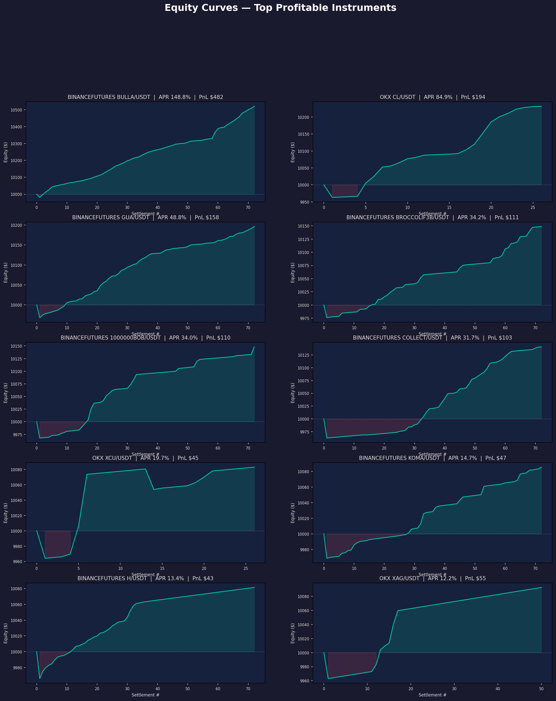
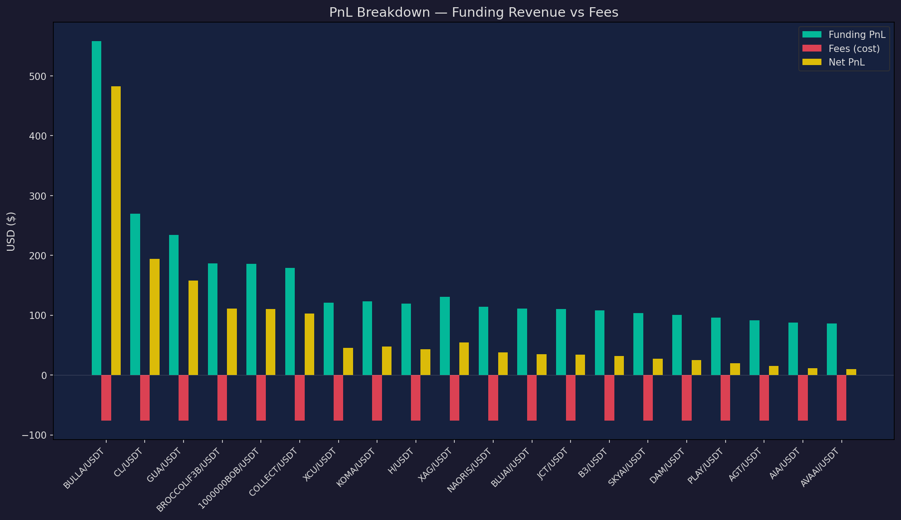

# Funding Rate Arbitrage Research

Research toolkit for analyzing and backtesting **funding rate arbitrage** on perpetual futures across OKX and Binance.

## Overview

Perpetual futures contracts charge/pay a **funding rate** every 8 hours (3× daily) to keep the contract price anchored to spot. When funding rates are consistently positive, short-perp holders get paid. This creates a delta-neutral yield opportunity:

> **Long Spot + Short Perp** → collect positive funding while remaining market-neutral.

This project provides three tools to evaluate these opportunities:

| Module | Purpose |
|--------|---------|
| `analyzer.py` | Cross-exchange spread analysis (OKX vs Binance) |
| `screener.py` | Single-exchange screening across all perp instruments |
| `backtester.py` | Historical simulation with equity curves, PnL breakdown, and charts |

## Strategy

### Single-Exchange (Spot-Perp)
1. Buy spot asset on exchange
2. Short equal-notional perpetual on the same exchange
3. Collect funding rate payments every 8 hours
4. Net position is delta-neutral (no directional risk)

### Cross-Exchange (Perp-Perp)
1. Long perp on exchange where you get paid (lower funding rate)
2. Short perp on exchange where you collect (higher funding rate)
3. Capture the spread between the two exchanges

## Backtest Results

### Overview Dashboard


### Equity Curves — Top 10 Instruments



### PnL Breakdown — Funding Revenue vs Fees



## Key Findings

Backtested across **627 instruments** on Binance Futures and OKX (Sep 2025 – Mar 2026):

| Metric | Value |
|--------|-------|
| Total instruments tested | 627 |
| Profitable (net positive) | 31 (4.9%) |
| Top APR | 148.8% (BULLA/USDT on Binance) |
| 2nd best | 84.9% (CL/USDT on OKX) |
| 3rd best | 48.8% (GUA/USDT on Binance) |
| BTC APR | 1.97% (low but consistent, 77% win rate) |
| ETH APR | 0.96% (73.5% positive funding rate) |

### Conclusions

1. **Most instruments are not profitable after fees.** Only ~5% of 627 instruments generated positive net returns. The 0.1% spot + 0.05% perp taker fees + 0.02% slippage per side eat into thin funding margins.

2. **High-APR opportunities exist in new/meme tokens** (BULLA 148%, GUA 48%, BROCCOLIF3B 34%) but come with:
   - Short data history (11-12 days only)
   - High basis risk (price swings up to 67%)
   - Low liquidity / high slippage risk

3. **Blue-chip funding arb (BTC, ETH) is low-yield but safe.** BTC at ~2% APR and ETH at ~1% APR are barely worth the capital lockup and execution risk in the current market.

4. **Fee optimization is critical.** Switching to maker orders (0.02% vs 0.1%) would dramatically improve profitability — many instruments near breakeven would flip positive.

5. **Best practical approach:** Focus on mid-cap tokens with consistently positive funding (>0.03% avg per settlement), reasonable liquidity, and at least 30+ days of history for statistical significance.

## Usage

```bash
# Screen all instruments
python3 -m projects.funding_rate_arb.screener

# Cross-exchange analysis
python3 -m projects.funding_rate_arb.analyzer

# Full backtest (all exchanges)
python3 -m projects.funding_rate_arb.backtester

# Single exchange
python3 -m projects.funding_rate_arb.backtester --exchange OKX

# Single symbol
python3 -m projects.funding_rate_arb.backtester --exchange BINANCEFUTURES --symbol BTCUSDT
```

## Configuration

| Parameter | Default | Description |
|-----------|---------|-------------|
| `MIN_SPREAD_ABS` | 0.0001 (0.01%) | Minimum spread to flag an opportunity |
| `MIN_DATA_POINTS` | 10 | Minimum funding rate samples required |
| `FEE_RATE_A` (OKX) | 0.05% | OKX taker fee |
| `FEE_RATE_B` (Binance) | 0.04% | Binance taker fee |
| `SLIPPAGE_PER_SIDE` | 0.02% | Estimated slippage |
| Initial capital | $10,000 | Per position |

## Limitations

- **Backtest ≠ live trading:** Assumes perfect execution, no liquidation risk
- **Basis risk:** Spot-perp price divergence is simplified
- **Liquidity:** No position sizing based on order book depth
- **Market impact:** Not modeled — large positions affect funding rates
- **Survivorship bias:** Only currently listed instruments are tested
