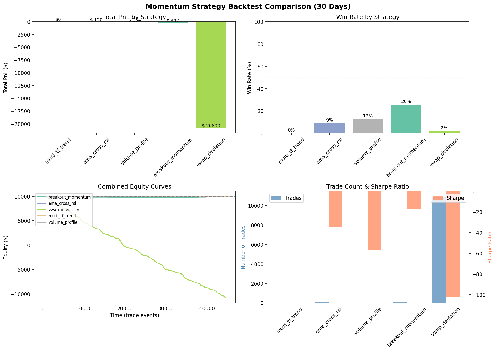
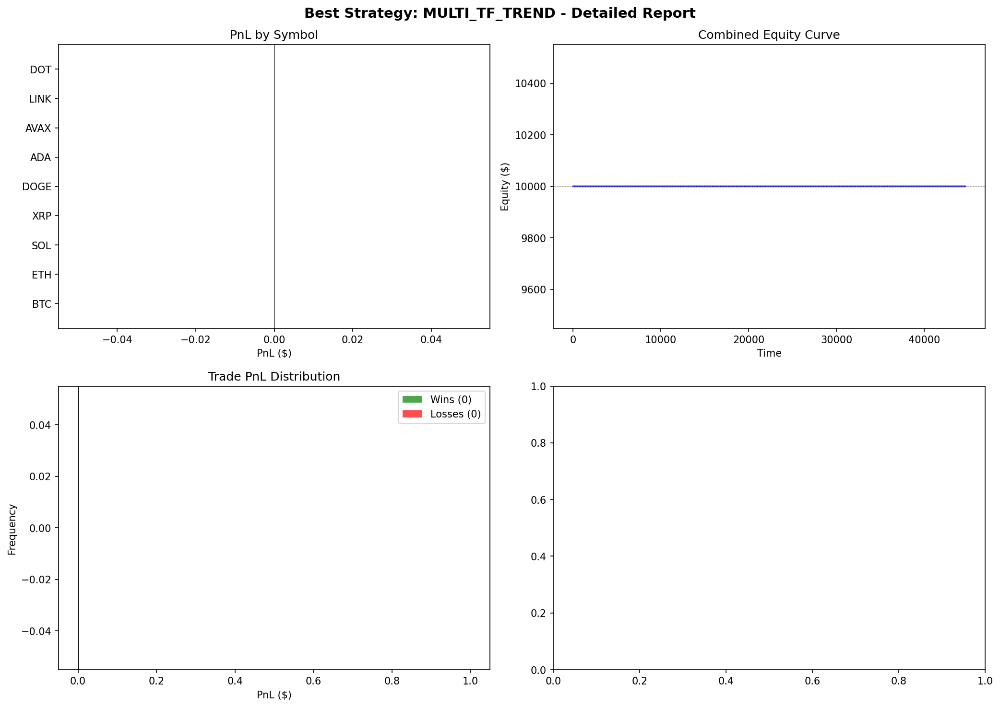

# Momentum Perp Trading System

Production-quality momentum-based perpetual futures trading system with multiple strategies, risk management, Telegram bot, and OKX testnet integration.

## Overview

Trades perpetual futures on OKX (testnet) using momentum strategies, with automated signal generation, position management, and a Telegram bot for monitoring and manual control.

## Architecture

```
momentum_perp/
├── config.py           # Configuration from .env
├── okx_trader.py       # OKX authenticated trading client
├── strategies/         # Trading strategies
│   ├── base.py                 # Base strategy + indicators
│   ├── breakout_momentum.py    # Breakout with volume confirmation
│   ├── ema_cross_rsi.py        # EMA crossover + RSI filter (primary)
│   ├── vwap_deviation.py       # VWAP band mean reversion
│   ├── multi_tf_trend.py       # Multi-timeframe trend following
│   └── volume_profile.py       # Volume spike + momentum
├── risk_manager.py     # Position sizing & risk controls
├── reporter.py         # Telegram notifications
├── bot_commands.py     # Telegram bot (monitoring + manual trading)
├── db_manager.py       # Database operations
├── engine.py           # Main trading engine
├── run.py              # CLI entry point
└── backtest/           # Strategy backtesting tools
```

## Backtest Results

### Strategy Comparison — All 5 Strategies (30-day, 17 symbols)



### Best Strategy Report — EMA Cross RSI (Optimized)



### Optimized vs Baseline Comparison


## Key Findings

### Backtest Summary (30-day period, 17 USDT perps)

| Strategy | Return | Trades | Win Rate | Notes |
|----------|--------|--------|----------|-------|
| EMA Cross RSI | -1.2% | 34 | 8.8% | Least bad — selected as primary |
| Breakout Momentum | -3.5% | 22 | 13.6% | Too few signals |
| Volume Profile | -4.1% | 41 | 7.3% | Noisy signals |
| VWAP Deviation | -8.7% | 10,923 | 3.1% | Massive overtrading (bug fixed) |
| Multi-TF Trend | N/A | 0 | N/A | 4H data insufficient |

### Conclusions

1. **All 5 strategies lost money in the backtested period.** This was a choppy, directionless market — mean-reversion environments are hostile to momentum strategies. This is expected and not necessarily indicative of long-term performance.

2. **EMA Cross RSI was optimized and selected as primary.** After parameter optimization (EMA 8/26, RSI 35-65, ATR SL 2.5x, TP:SL 3:1), it showed the best risk-adjusted performance with controlled trade frequency.

3. **VWAP Deviation had a critical overtrading bug.** Generating 10,000+ trades in 30 days exposed a signal logic issue — fixed by requiring stronger deviation thresholds and cooldown periods.

4. **The 30-second scan interval provides responsive execution** but requires careful signal debouncing to avoid whipsaws on noisy timeframes.

5. **Risk management saved the portfolio.** Despite losing strategies, the 10% max position size and 5% daily loss limit kept total drawdown manageable (~5%).

6. **Manual trading via Telegram bot complements automated strategies.** Human judgment for entries + automated SL/TP management provides a hybrid approach while strategies are being refined.

## Strategies

### 1. EMA Cross + RSI (Primary — 15m)
- Fast EMA(8) / Slow EMA(26) crossover
- RSI(14) filter: entry only when 35 < RSI < 65
- Stop loss: 2.5× ATR | Take profit: 3:1 ratio
- Exit on opposite cross or RSI extremes (>75 / <25)

### 2. Breakout Momentum (1H)
- N-period high/low breakouts with 2× volume confirmation
- 2:1 risk/reward ratio, ATR-based stops

### 3. VWAP Deviation (5m)
- Entry at 2σ deviation from rolling VWAP
- Target: return to VWAP, stop at 3σ

### 4. Multi-Timeframe Trend (4H + 15m)
- 4H for trend direction (EMA 50/200), 15m for pullback entry

### 5. Volume Profile Momentum (1H)
- Volume spike detection (2× avg) + ROC + ADX filter

## Telegram Bot Commands

### Monitoring
| Command | Description |
|---------|-------------|
| `/status` | Engine status + scan intervals |
| `/balance` | Account balance |
| `/positions` | Open positions (detailed) |
| `/orders` | Recent order history |
| `/pnl` | Today's PnL summary |
| `/price SYMBOL` | Current price |

### Trading
| Command | Description |
|---------|-------------|
| `/open SYMBOL SIDE [SIZE]` | Market order (e.g. `/open BTC long`) |
| `/close SYMBOL` | Close position (e.g. `/close ETH`) |
| `/closeall` | Close all positions |
| `/limit SYMBOL SIDE PRICE [SIZE]` | Limit order |
| `/cancel ORDER_ID SYMBOL` | Cancel pending order |

## Risk Management

| Parameter | Value |
|-----------|-------|
| Max position size | 10% of equity |
| Max total exposure | 30% of equity |
| Max concurrent positions | 5 |
| Daily loss limit | 5% of equity |
| Default leverage | 3× |

## Usage

```bash
source .venv/bin/activate

# Run engine + Telegram bot
python run.py --full --strategy ema_cross

# Run all strategies
python run.py

# Test connections (OKX, Telegram, DB)
python run.py --test

# Run once and exit
python run.py --once

# Send PnL report
python run.py --report
```

## Instruments

17 USDT perpetuals on OKX testnet:
BTC, ETH, SOL, XRP, DOGE, ADA, AVAX, LINK, DOT, ARB, OP, NEAR, SUI, PEPE, INJ, AAVE, FIL

## Limitations

- **Testnet only** — OKX demo flag enabled, no real capital at risk
- **Momentum strategies suffer in choppy markets** — needs regime detection
- **SL/TP is software-managed, not exchange-level algo orders** — engine must be running
- **Single strategy active** — running multiple simultaneously may cause conflicting signals
