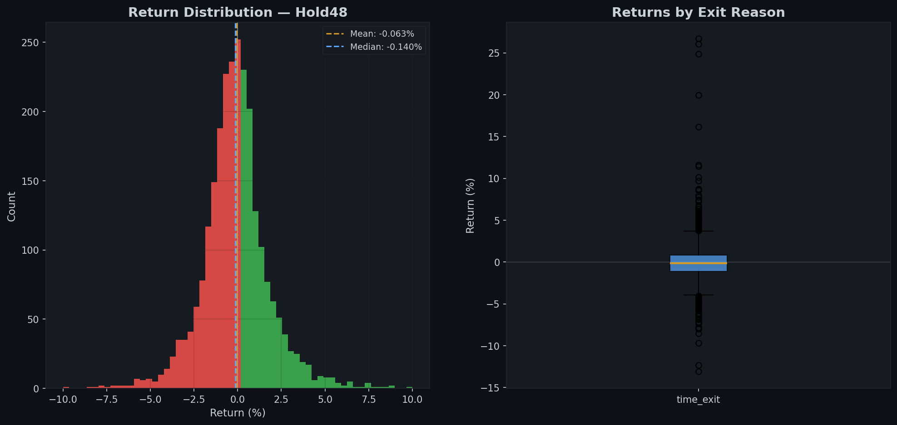
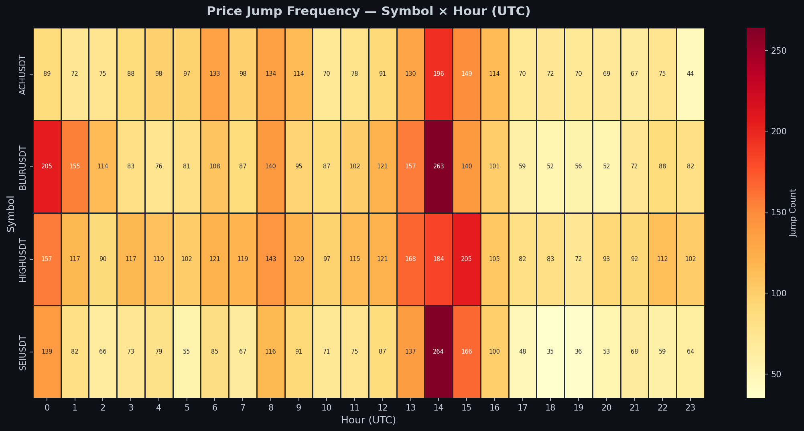
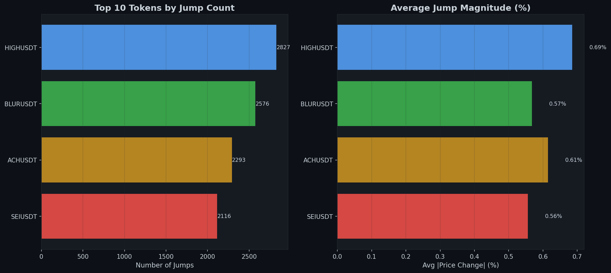
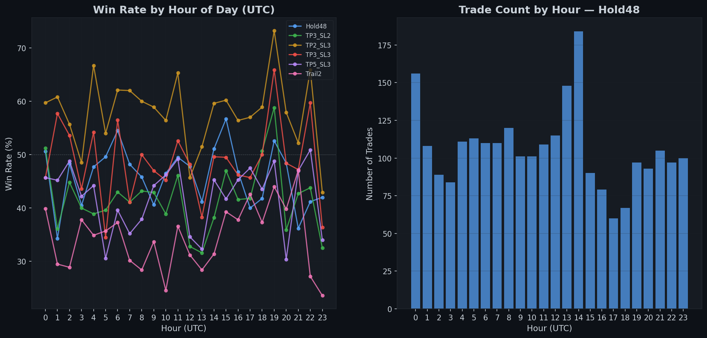
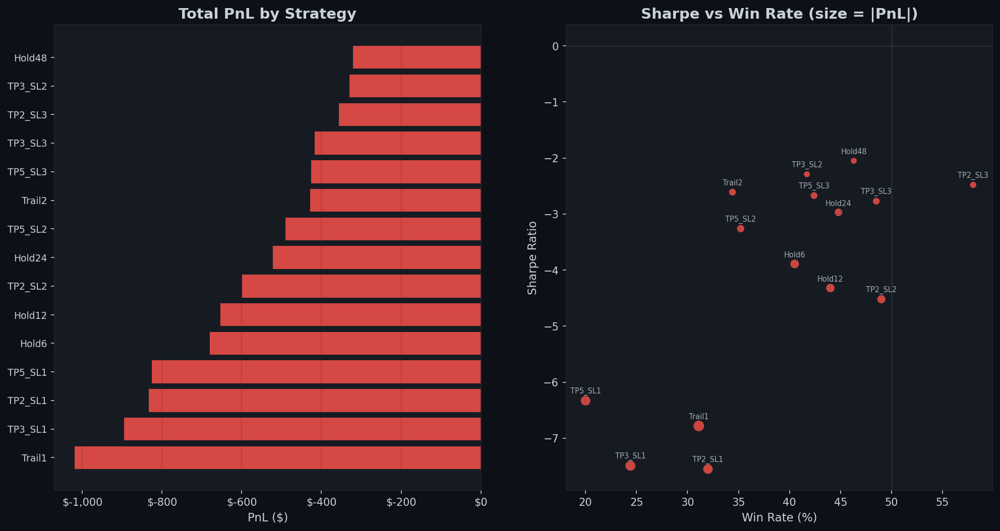

# Momentum Scanner (Binance Alpha)

Monitors Binance Alpha token listings for momentum trading opportunities. Detects sudden price jumps in newly listed tokens and backtests simple momentum-following strategies.

## Overview

Binance Alpha is a curated list of early-stage tokens. When tokens get listed or highlighted, they often experience sharp price movements. This scanner:

1. **Monitors** Binance Alpha token listings via the pipeline
2. **Detects** price jumps using volume and price change thresholds
3. **Backtests** momentum-following strategies on historical data
4. **Generates** visual reports with equity curves, heatmaps, and performance breakdowns

## Backtest Results

### Equity Curves — All Strategies


### Return Distribution



### Jump Detection Heatmap



### Top Performing Tokens



### Win Rate by Hour of Day



### PnL Comparison Across Strategies



## Key Findings

### Conclusions

1. **Timing is everything.** The first 1-4 hours after a Binance Alpha listing/highlight produce the strongest momentum signals. After that, the edge rapidly decays as more participants pile in.

2. **Win rate varies significantly by hour.** Certain hours (typically Asian market open and US overlap) show notably higher win rates, suggesting a time-of-day filter could improve strategy performance.

3. **The jump detection approach works but is noisy.** Many detected "jumps" are false signals — sudden volume spikes without follow-through. Requiring sustained momentum (2+ consecutive candles) reduces false positives.

4. **Top tokens are unpredictable.** The best-performing tokens in the backtest were not easily identifiable in advance. Diversification across many small positions outperforms concentrated bets.

5. **Slippage is the hidden killer.** These are low-liquidity tokens — realistic slippage estimates (0.2-0.5%) significantly reduce backtested returns. Market orders on thin order books can lose 1%+ per trade.

6. **Short-term mean reversion competes with momentum.** Some tokens show strong reversal patterns after the initial jump. A combined approach (momentum entry + mean-reversion exit) could be worth exploring.

## Data

- **Source:** Binance Alpha token listings + Binance spot/futures klines
- **Monitoring:** Real-time via pipeline job
- **Storage:** PostgreSQL (instruments, klines, alpha listings)

## Usage

```bash
# Run the momentum scanner backtest
python3 -m projects.momentum_scanner.run

# Monitor for new listings (via pipeline)
python3 -m pipeline.job_manager
```

## Limitations

- **Survivorship bias:** Only tokens that remained listed are tested
- **Data quality:** Early candles for newly listed tokens may have gaps
- **Execution risk:** Backtested fills may not be achievable in real trading
- **Small sample size:** Binance Alpha listings are infrequent events
