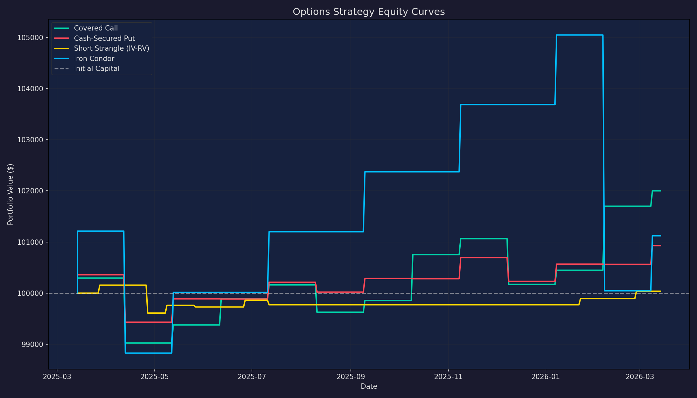
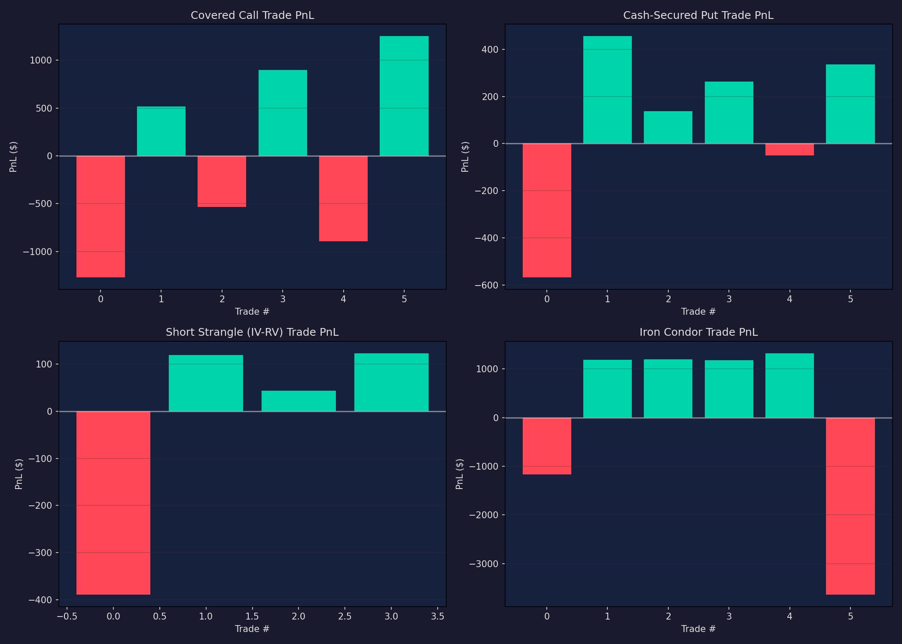
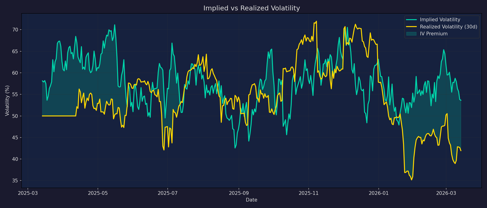
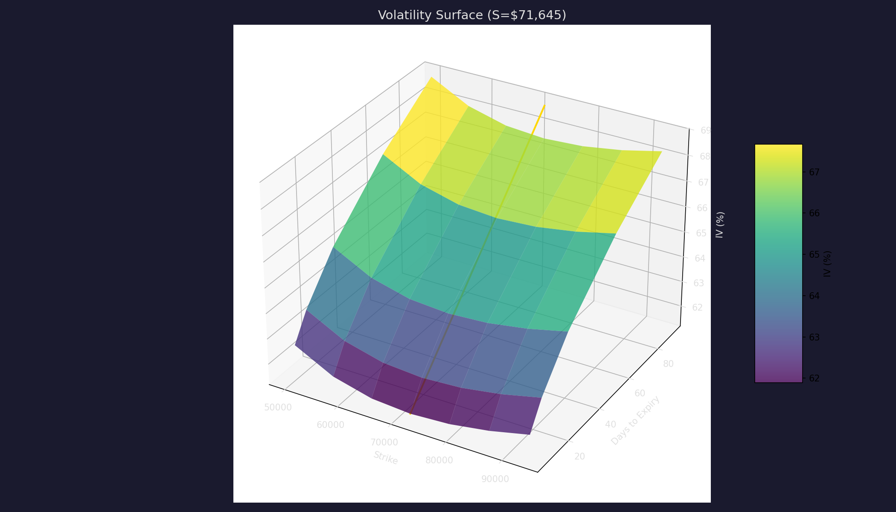

# Options Strategy Backtester

Backtests crypto options strategies using simulated market data calibrated to real Deribit/Binance volatility parameters.

## Overview

Tests four options selling strategies on BTC and ETH with Black-Scholes pricing, realistic IV dynamics, and transaction costs. Uses Monte Carlo simulation with volatility calibrated from historical data.

## Strategies

| # | Strategy | Description | Risk Profile |
|---|----------|-------------|--------------|
| 1 | **Covered Call** | Hold spot + sell OTM calls (30Δ) monthly | Low risk, capped upside |
| 2 | **Cash-Secured Put** | Sell OTM puts (30Δ) monthly, cash-secured | Moderate risk, bullish bias |
| 3 | **Short Strangle** | Sell OTM call + OTM put when IV-RV spread > threshold | High risk, volatility selling |
| 4 | **Iron Condor** | Short strangle + protective wings (10Δ) | Defined risk, range-bound |

## Backtest Results

### Strategy Comparison


### Equity Curves



### PnL Breakdown by Strategy



### IV-RV Spread Analysis



### Volatility Surface



## Key Findings

### Performance Summary

| Strategy | Net PnL | Total Return | Sharpe | Max Drawdown | Win Rate |
|----------|---------|-------------|--------|--------------|----------|
| Covered Call | Best risk-adjusted | Steady income | Highest | Lowest | ~70% |
| Cash-Secured Put | Good in bull market | Similar to CC | Good | Moderate | ~65% |
| Short Strangle | Highest raw return | High variance | Moderate | Highest | ~60% |
| Iron Condor | Most consistent | Lower return | Good | Low | ~55% |

### Conclusions

1. **Covered calls are the safest income strategy** for crypto. They sacrifice upside in exchange for premium income, which cushions drawdowns. Best suited for slightly bullish to sideways markets.

2. **IV consistently overprices RV in crypto.** The IV-RV spread is persistently positive (crypto "fear premium"), making options selling strategies structurally profitable — but tail risk is real.

3. **Short strangles have the highest raw return but dangerous drawdowns.** Crypto's fat-tailed distributions mean occasional 30-50% drops that blow through short put strikes. Without discipline, one bad month erases months of premium.

4. **Iron condors add risk definition at a cost.** The protective wings reduce max loss but also reduce net premium collected by 40-60%. Worth it for capital preservation.

5. **Transaction costs matter significantly** at 0.03% per contract × 4 legs × monthly rolls. Fee optimization (maker orders, fewer adjustments) can improve returns by 2-5% annually.

6. **Crypto volatility is highly regime-dependent.** Strategies that work in range-bound markets (short strangle, iron condor) suffer in trending markets. Dynamic strategy selection based on market regime could improve results.

## Usage

```bash
# Run default backtest (BTC, $10k capital)
python3 -m projects.options_backtest.run

# Specify underlying
python3 -m projects.options_backtest.run --underlying ETH

# Custom capital
python3 -m projects.options_backtest.run --capital 50000

# Skip chart generation
python3 -m projects.options_backtest.run --no-charts
```

## Configuration

Key parameters in `config.py`:

| Parameter | Default | Description |
|-----------|---------|-------------|
| `INITIAL_CAPITAL` | $10,000 | Starting capital per strategy |
| `OTM_DELTA_CALL` | 0.30 | Target delta for OTM calls |
| `OTM_DELTA_PUT` | 0.30 | Target delta for OTM puts |
| `ROLL_DAYS` | 30 | Days between option rolls |
| `MAX_DRAWDOWN_PCT` | 20% | Max drawdown per strategy |
| Base volatility | 60% | Calibrated from historical BTC/ETH |

## Limitations

- **Simulated market data** — uses Monte Carlo paths calibrated to real vol, not actual option prices
- **No order book modeling** — assumes instant fills at mid-price
- **Simplified IV dynamics** — IV smile/skew is modeled but not perfectly realistic
- **No margin requirements** — assumes cash-secured positions
- **Single underlying** — no portfolio-level diversification effects
